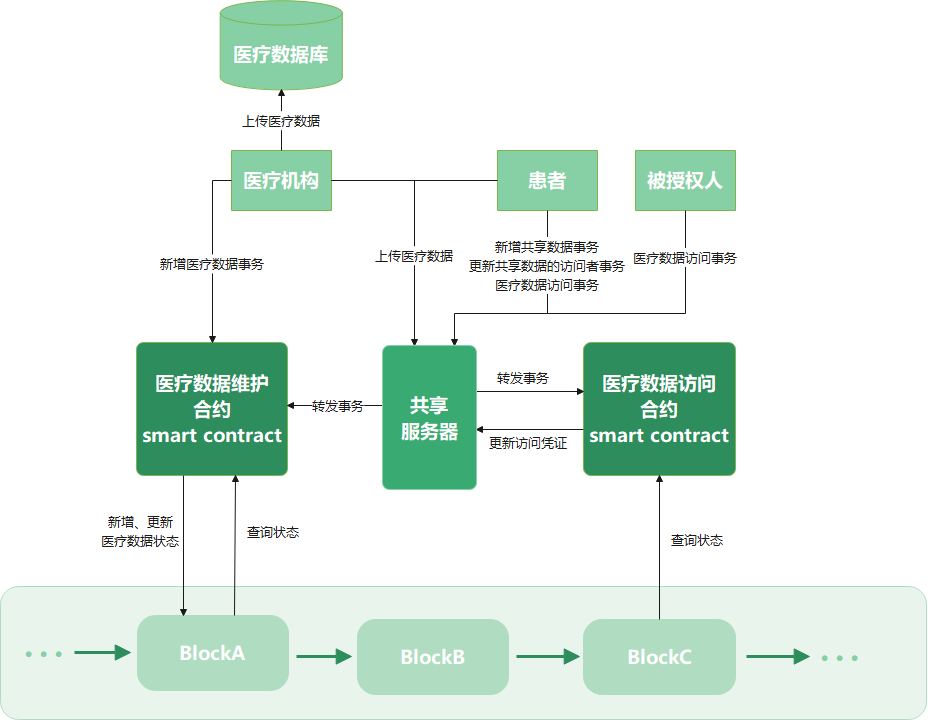
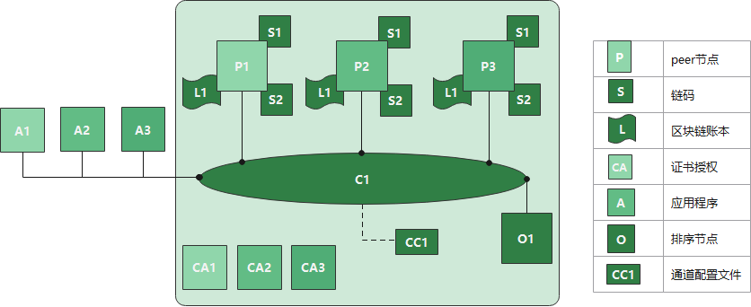

# MDS
MDS是一个结合区块链和零知识证明的医疗数据安全共享方案，使用fabric区块链和libsnark库实现

方案架构如下



MDS方案的测试网络结构如下，链码S1和S2分别对应`mdmanage`和`pdmanage`



需要说明的是，由于Hyperledger Fabric区块链支持私有数据的交易，MDS方案中共享服务器的功能在本实验中由维护私有数据的链码实现。加密的医疗数据和通知被授权节点新增医疗数据的消息都作为私有数据存储在peer节点的不同私有数据集合中，由链码进行访问控制。当用户需要下载医疗数据或查看是否有新增医疗数据时需要调用链码来完成操作。区块链网络中传输的私有数据不会被记录在账本中，被记录的只有私有数据的hash值，用以事务的验证

## 准备工作

### Ubuntu下搭建Fabric运行环境

| 名称         | 类型                | 版本          |
| ------------ | ------------------- | ------------- |
| 操作系统     | Linux系统           | Ubuntu  18.04 |
| 容器         | Docker              | v20.10.6      |
| 容器工具     | Docker  Compose     | v1.27.2       |
| 区块链       | Hyperledger  Fabric | v2.3.2        |
| 证书授权服务 | Hyperledger  Fabric | v1.5.0        |
| 链码编程语言 | Go语言              | v1.14         |

1. 安装git、curl、docker、go、node

2. 运行脚本安装Fabric Sample、docker images、和Fabric的二进制文件，运行前确保docker正在运行

   ```bash
   docker ps -a
   # 安装指定版本的Fabric v2.1.1 and Fabric CA v1.4.7
   curl -sSL https://bit.ly/2ysbOFE | bash -s -- 2.3.2 1.5.0
   ```

3. 测试网络

   ```bash
   # 切换到fabric-samples/test-network
   cd fabric-samples/test-network
   # 启动网络
   ./network.sh up createChannel -c mychannel -ca
   # 关闭网络
   ./network.sh down
   ```

4. 将mds/fabric-samples下的文件移动到第2步下载的fabric-samples下文件夹下

   ```bash
   # 下载mds源码
   git clone https://github.com/Wells-yuan/mds.git
   # 文件路径如下
   #.
   #├── fabric-samples
   #└── mds
   cp -rf ./mds/fabric-samples/* fabric-samples/
   ```


### 编译libnark库

1. 准备环境

   ```bash
   sudo apt-get install build-essential cmake git libgmp3-dev libprocps-dev python-markdown libboost-all-dev libssl-dev pkg-config
   ```

2. 编译

   ```bash
   cd ~/libsnark
   mkdir build && cd build
   cmake ..
   make
   # 生成零知识证明所需的密钥对
   ./src/produce_key
   ./src/share_key
   ./src/update_key
   ./src/access_key
   # 复制密钥对到/usr/local/prfkey和fabric-samples/mds/mydocker/prfKey
   cp -rf ./*.raw /usr/local/prfKey/
   cp -rf ./*raw ~/github/fabric-samples/mds/mydocker/prfKey
   # 复制动态库到/usr/local/lib和fabric-samples/mds/mydocker/lib
   cp -rf ./src/libzk_produce.so ./src/libzk_share.so ./src/libzk_update.so ./src/libzk_access.so ./depends/libsnark/libsnark/libsnark.so ./depends/libsnark/depends/libff/libff/libff.so /usr/local/lib
   cp -rf ./src/libzk_produce.so ./src/libzk_share.so ./src/libzk_update.so ./src/libzk_access.so ./depends/libsnark/libsnark/libsnark.so ./depends/libsnark/depends/libff/libff/libff.so ~/github/fabric-samples/mds/mydocker/lib
   ```


### 外部启动器构造步骤(Fabric 2.3.2)

1. 设置peer节点构建外部链码的脚本

   > 即fabric-samples/mds/mydocker/myBuilder文件夹下的脚本

2. 修改`fabric-samples/config/core.yaml`
   
    ```bash
    externalBuilders:
        - path: /opt/gopath/src/github.com/hyperledger/sampleBuilder
          name: mybuilder
    ```
    
   修改`fabric-samples/test-network/docker/docker-compose-test-net.yaml`
   
    ```bash
    # 将/root/bbb/fabric-samples替换为fabric-samples所在路径
    volumes:
        - /root/bbb/fabric-samples/mds/mydocker/myBuilder:/opt/gopath/src/github.com/hyperledger/myBuilder
    - /root/bbb/fabric-samples/mds/mydocker/core.yaml:/etc/hyperledger/fabric/core.yaml
    ```
   
3. 给外部链码打包信息包，安装在各个需要调用外部链码的组织上

    1. 准备好`chaincode.env`

        ```bash
        # CHAINCODE_SERVER_ADDRESS must be set to the host and port where the peer can
        # connect to the chaincode server
        CHAINCODE_SERVER_ADDRESS=mdmanage.example.com:9999
        
        # CHAINCODE_ID must be set to the Package ID that is assigned to the chaincode
        # on install. The `peer lifecycle chaincode queryinstalled` command can be
        # used to get the ID after install if required
        CHAINCODE_ID=mdmanage_1.0:e42ce496cca0ad2dbe7be3c3155aca0d4e32a4fe5ffabc456b9b6e004781533a
        ```

        `CHAINCODE_SERVER_ADDRESS`指运行外部链码的网络地址

        `CHAINCODE_ID`指安装好的外部链码信息包的`Package ID`

        在外部链码源码文件的`main` 函数中，会启动一个`chaincode server`来监听该网络地址和链码包ID，完成与需要执行该外部链码的peer节点的通信

    2. 准备好connect.json

        ```bash
        {
            "address": "mdmanage.example.com:9999",
            "dial_timeout": "10s",
            "tls_required": false
        }
        ```

        `address`为启动image时赋予的hostname和Dockerfile中暴露的端口号

    3. 准备好`metadata.json`

        ```bash
        {
            "type": "external",
            "label": "mdmanage_1.0"
        }
        ```

        `type`表明该链码包是外部链码的信息包，一般`type`为链码的语言类型

        `label`就是打包链码时的标签

    4. 打包链码包

        ```bash
        # 切换到以下路径
        cd fabric-samples/mds/mydocker/config/
        # 将connection.json打包为 code.tar.gz
        tar cfz code.tar.gz connection.json
        # 将 metadata.json 和 code.tar.gz 一起打包为 链码包
        tar cfz mdmanage-external.tgz metadata.json code.tar.gz
        # 方便后续操作，将 mdmanage-external.tgz 移动到 fabric-samples/test-network/目录下
        cp mdmanage-external.tgz ../../../test-network/
        ```

    5. 安装`mdmanage-external.tgz`之后替换`chaincode.env`中的`CHAINCODE_ID`


## 搭建MDS方案实验网络

1. 启动网络，准备链码包

   ```bash
   # 切换到以下路径
   cd fabric-samples/test-network
   # 启动网络
   ./network.sh up createChannel -c mychannel -ca
   # 安装链码包
   export PATH=${PWD}/../bin:$PATH
   export FABRIC_CFG_PATH=$PWD/../config/
   export CORE_PEER_TLS_ENABLED=true
   export CORE_PEER_LOCALMSPID="Org1MSP"
   export CORE_PEER_TLS_ROOTCERT_FILE=${PWD}/organizations/peerOrganizations/org1.example.com/peers/peer0.org1.example.com/tls/ca.crt
   export CORE_PEER_MSPCONFIGPATH=${PWD}/organizations/peerOrganizations/org1.example.com/users/Admin@org1.example.com/msp
   export CORE_PEER_ADDRESS=localhost:7051
   
   peer lifecycle chaincode install mdmanage-external.tgz
   
   export CORE_PEER_LOCALMSPID="Org2MSP"
   export CORE_PEER_TLS_ROOTCERT_FILE=${PWD}/organizations/peerOrganizations/org2.example.com/peers/peer0.org2.example.com/tls/ca.crt
   export CORE_PEER_MSPCONFIGPATH=${PWD}/organizations/peerOrganizations/org2.example.com/users/Admin@org2.example.com/msp
   export CORE_PEER_ADDRESS=localhost:9051
   
   peer lifecycle chaincode install mdmanage-external.tgz
   
   export CHAINCODE_ID=mdmanage_1.0:e42ce496cca0ad2dbe7be3c3155aca0d4e32a4fe5ffabc456b9b6e004781533a
   ```

2. 准备执行外部链码的容器

   ```bash
   # 切换到/fabric-samples/mds/chaincode-go/mdmanage
   # 编译mdmanage链码
   go build
   # 将mdmanage移动到/fabric-samples/mds/mydocker/external/
   mv mdmanage ../../mydocker/external/chaincode
   # 切换到/fabric-samples/mds/mydocker/
   cd ../../mydocker
   # 构建容器
   docker build -t mds/mdmanage:1.0 .
   # 启动容器
   docker run -it --rm --name mdmanage.example.com --hostname mdmanage.example.com --env-file ./config/chaincode.env --network=fabric_test mds/mdmanage:1.0
   ```

3. 批准外部链码mdmanage

   ```bash
   export CORE_PEER_LOCALMSPID="Org2MSP"
   export CORE_PEER_TLS_ROOTCERT_FILE=${PWD}/organizations/peerOrganizations/org2.example.com/peers/peer0.org2.example.com/tls/ca.crt
   export CORE_PEER_MSPCONFIGPATH=${PWD}/organizations/peerOrganizations/org2.example.com/users/Admin@org2.example.com/msp
   export CORE_PEER_ADDRESS=localhost:9051
   
   peer lifecycle chaincode approveformyorg -o localhost:7050 --ordererTLSHostnameOverride orderer.example.com --tls --cafile "$PWD/organizations/ordererOrganizations/example.com/orderers/orderer.example.com/msp/tlscacerts/tlsca.example.com-cert.pem" --channelID mychannel --name mdmanage --version 1.0 --package-id $CHAINCODE_ID --sequence 1
   
   export CORE_PEER_LOCALMSPID="Org1MSP"
   export CORE_PEER_TLS_ROOTCERT_FILE=${PWD}/organizations/peerOrganizations/org1.example.com/peers/peer0.org1.example.com/tls/ca.crt
   export CORE_PEER_MSPCONFIGPATH=${PWD}/organizations/peerOrganizations/org1.example.com/users/Admin@org1.example.com/msp
   export CORE_PEER_ADDRESS=localhost:7051
   
   peer lifecycle chaincode approveformyorg -o localhost:7050 --ordererTLSHostnameOverride orderer.example.com --tls --cafile "$PWD/organizations/ordererOrganizations/example.com/orderers/orderer.example.com/msp/tlscacerts/tlsca.example.com-cert.pem" --channelID mychannel --name mdmanage --version 1.0 --package-id $CHAINCODE_ID --sequence 1
   
   peer lifecycle chaincode commit -o localhost:7050 --ordererTLSHostnameOverride orderer.example.com --tls --cafile "$PWD/organizations/ordererOrganizations/example.com/orderers/orderer.example.com/msp/tlscacerts/tlsca.example.com-cert.pem" --channelID mychannel --name mdmanage --peerAddresses localhost:7051 --tlsRootCertFiles "$PWD/organizations/peerOrganizations/org1.example.com/peers/peer0.org1.example.com/tls/ca.crt" --peerAddresses localhost:9051 --tlsRootCertFiles organizations/peerOrganizations/org2.example.com/peers/peer0.org2.example.com/tls/ca.crt --version 1.0 --sequence 1
   ```

4. 安装私有数据维护链码pdmanage

   ```bash
   ./network.sh deployCC -ccn pdmanage -ccp ../mds/chaincode-go/pdmanage/ -ccl go -ccep "OR('Org1MSP.peer','Org2MSP.peer')" -cccg ../mds/chaincode-go/pdmanage/collections_config.json
   ```

5. 查询成功安装的链码

   ```bash
   peer lifecycle chaincode queryinstalled
   ```


### MDS方案测试

1. 注册用户

   ```bash
   # 新开终端，切换到/fabric-samples/mds/application-go/patient
   export LD_LIBRARY_PATH=/usr/local/lib
   rm -r wallet/
   rm -r ../hospital/wallet/
   # 第一次需要运行npm install
   node enrollAdmin.js
   node registerUser.js patientA
   node registerUser.js patientB
   node registerUser.js agencyA
   go run patient.go -u patientA -f print
   cd ../hospital
   # 第一次需要运行npm install
   node enrollAdmin.js
   node registerUser.js hospitalA
   ```

2. 修改对应命令，进行方案测试

   ```bash
   go run hospital.go -u hospitalA -f create -p 3059301306072a8648ce3d020106082a8648ce3d03010703420004d0d15a3ce90738eeaed4e7f74eb1a10a2a696c88fb39ea9a426e4a5c87cb2fd667b7a4906507314c2a88974541c5ab87447e1822464dcc2ae5bc21018bd67123 '{"白细胞计数":"9.25", "血小板计数": "368", "血红蛋白量":"152"}'
   cd ../patient
   go run patient.go -u patientA -f check
   go run patient.go -u patientA -f access -t '{"id":"bde9b401b8648dbdaf4a1e147466b04b8d8cef723886468e602b35f2ef003871","aux":"0422c939e079d55c434ff0c14f5fe6d14319b28b489f3be31a8e32144f330fc880946640aea885cd89cf5a5b47aae93259507c0191af57246f1103807c52bc5bb44cb4704b2c3d0a22203299b0ca216a07dd5cbeb17a2c57e950c2e22ecddc2d9e5afa678635842a93d0295f9e9095c3d37b1c1fbbd1e6542d3d98e5a3e048c2147370e3f0fff12c21d5ecd8d053a5519febadb9ac49755ced3328b8b280132917afdfd302d29283283490fda296e100b807a6e490da671c4b7967dc193cb0ecdb7e3c68270280fa91c007b0a8b9bc86bbe1"}'
   # 该命令中的随机数r是生成token所需的r
   go run patient.go -u patientA -f download -r '{"id":"bde9b401b8648dbdaf4a1e147466b04b8d8cef723886468e602b35f2ef003871","r":"27033842393301284","ek":"2c6f77ac53bdca9c7f48badbcadeb7d1e00455bd8aa9ce7ee4b615b2a7cc0c3c"}'
   # 该命令中的随机数r是生成ek所需的r，role即是produce事务中对医疗数据唯一标识产生的数字签名
   go run patient.go -u patientA -f share -s '{"id":"bde9b401b8648dbdaf4a1e147466b04b8d8cef723886468e602b35f2ef003871","r":"13399548544741956","ek":"2c6f77ac53bdca9c7f48badbcadeb7d1e00455bd8aa9ce7ee4b615b2a7cc0c3c","role":"304402201bb197bf8fa79370747d18d54d59d7eb9b8bfc14a00cc03970b797d8bdaea6400220262e107f569c86be493f290b17e502b366fb55778aea4cad36146fdca5d6bf41"}' -k '白细胞计数,血红蛋白量' -v 3059301306072a8648ce3d020106082a8648ce3d03010703420004e36e16e9a20bcdc1adf1e5739ba56301959caeb241585ccd88410a60f8d7901a0c1cc26fc94c2d661ab60d9a0d247610dc5e4653c0c5246f1e78cdeaa76ca59e '{"白细胞计数":"9.25", "血小板计数": "368", "血红蛋白量":"152"}'
   go run patient.go -u agencyA -f check
   go run patient.go -u patientA -f update -s '{"id_B":"b525ee87d3d1ea744e9a2705b2f32d2f70d190be375f6d6be92c7ecaf30ab2b4","ek":"10ce445c2be2c7f5b225fe992ad4f90b506c48707ecbe04ae55f03e1e9e07fdd","r":"19889659903513476","id_A":"bde9b401b8648dbdaf4a1e147466b04b8d8cef723886468e602b35f2ef003871","index":[0,2],"visitors":["3059301306072a8648ce3d020106082a8648ce3d03010703420004e36e16e9a20bcdc1adf1e5739ba56301959caeb241585ccd88410a60f8d7901a0c1cc26fc94c2d661ab60d9a0d247610dc5e4653c0c5246f1e78cdeaa76ca59e"]}' -v 3059301306072a8648ce3d020106082a8648ce3d030107034200048419f2aaa8943bab3f6214a1cab571010890fed10890b8a4960b36a6baaf5a263f6b519caaba645ad08cefc783bce220f50fb0d146707e783d803b2b234b1717
   go run patient.go -u patientB -f check
   go run patient.go -u patientB -f queryall
   ```
